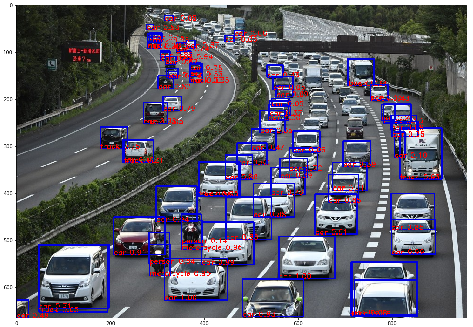

# ODAch, An Object Detection TTA tool for Pytorch
ODA is a test-time-augmentation (TTA) tool for 2d object detectors. 

For use in Kaggle object detection competitions.

:star: if it helps you! ;)



# Install
`pip install odach`

# Usage
See `Example.ipynb`.

The setup is very simple, similar to [ttach](https://github.com/qubvel/ttach).

## Singlescale TTA
```python
import odach as oda
# Declare TTA variations
tta = [oda.HorizontalFlip(), oda.VerticalFlip(), oda.Rotate90(), oda.Multiply(0.9), oda.Multiply(1.1)]

# load image
img = loadimg(impath)
# wrap model and tta
tta_model = oda.TTAWrapper(model, tta)
# Execute TTA!
boxes, scores, labels = tta_model(img)
```

## Multiscale TTA
```python
import odach as oda
# Declare TTA variations
tta = [oda.HorizontalFlip(), oda.VerticalFlip(), oda.Rotate90(), oda.Multiply(0.9), oda.Multiply(1.1)]
# Declare scales to tta
scale = [0.8, 0.9, 1, 1.1, 1.2]

# load image
img = loadimg(impath)
# wrap model and tta
tta_model = oda.TTAWrapper(model, tta, scale)
# Execute TTA!
boxes, scores, labels = tta_model(img)
```

* The boxes are also filtered by nms(wbf default).

* The image size should be square.

## model output wrapping
* Wrap your detection model so that the output is similar to torchvision frcnn format:
[["box":[[x,y,x2,y2], [], ..], "labels": [0,1,..], "scores": [1.0, 0.8, ..]]

## Thanks
nms, wbf are from https://kaggle.com/zfturbo

tta is based on https://github.com/qubvel/ttach, https://github.com/andrewekhalel/edafa/tree/master/edafa and https://www.kaggle.com/shonenkov/wbf-over-tta-single-model-efficientdet
